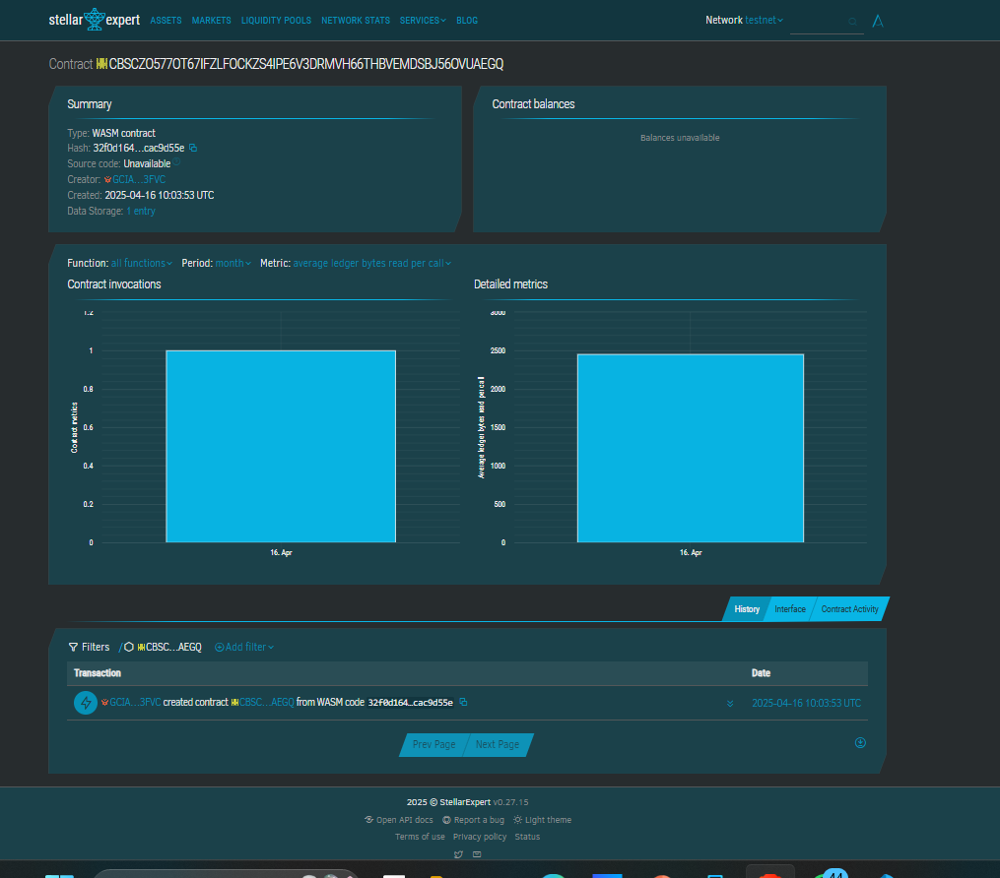

# Blockchain-based Social Media Rewards

## 📌 Project Title
Blockchain-based Social Media Rewards

## 📄 Project Description
A decentralized Soroban smart contract that rewards users with points for their social media activity, such as creating quality content or engaging meaningfully with others. It enables transparent and verifiable reward distribution without centralized control.

## 🌟 Project Vision
To revolutionize content engagement on social platforms by fairly and transparently rewarding valuable contributions using blockchain technology. Empower creators and communities alike with tokenized incentives that can be tracked and managed on-chain.

## 🔑 Key Features
- **Reward Posts:** Award users with on-chain points for individual posts.
- **Query Rewards:** Retrieve reward data for any post.
- **Total Rewards Tracking:** Keep track of cumulative reward points distributed on the platform.

## 🔧 Contract Details
### Contract Address: CBSCZO577OT67IFZLFOCKZS4IPE6V3DRMVH66THBVEMDSBJ56OVUAEGQ 

### Functions:
- `reward_post(user: Address, post_id: String, reward_points: u64)`
  - Authenticated users can reward points to themselves (or others) for a given post ID.
- `get_reward(post_id: String) -> Option<RewardEntry>`
  - Returns the reward entry for a given post ID, if it exists.
- `get_total_rewards() -> u64`
  - Returns the total number of reward points given on the platform.

### Storage:
- `RewardKey::UserPost(post_id)` → `RewardEntry`
- `TOTAL_REWARDS` → `u64`

---

> Built with 💙 using the Soroban SDK.
